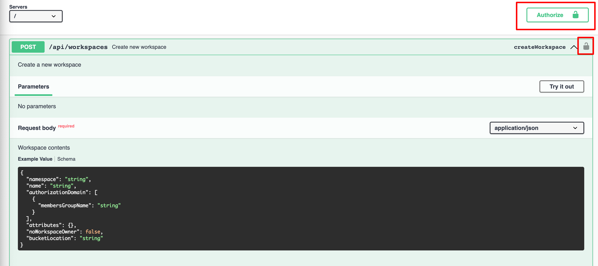
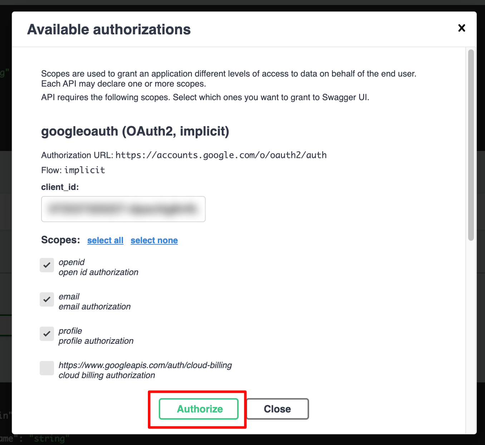
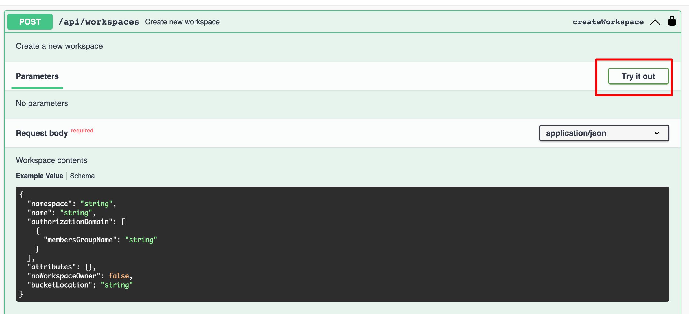
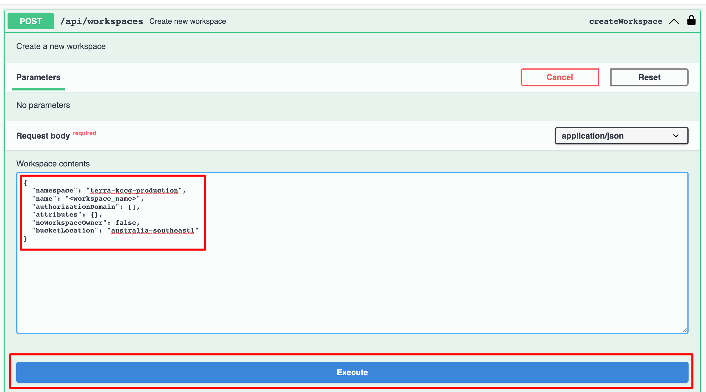

# Terra workspace setup

- Go to the Swagger UI for Terra - this is a web-based form that exposes the API endpoints for Terra. Currently, this is the only way to create an Australian-based workspace in Terra.
  - [https://rawls.dsde-prod.broadinstitute.org/#/workspaces/createWorkspace](https://rawls.dsde-prod.broadinstitute.org/#/workspaces/createWorkspace)
- Click the 'Authorize' button and follow the prompts to authorise with your Garvan Google account.
    
    
- Click on 'Try it out', enter the relevant information into the JSON object in the text field, then click 'Execute'
    
    
    - The JSON data should be structured like this:
        ``` json
        {
        "namespace": "<terra billing project>",
        "name": "<workspace name>",
        "authorizationDomain": [],
        "attributes": {},
        "noWorkspaceOwner": false,
        "bucketLocation": "australia-southeast1"
        }
        ```
    - It's important that the 'bucketLocation' is set to 'australia-southeast1'.
    - Currently the billing project ('namespace') we're using is 'terra-kccg-production'
- The Terra project should now be created and available in the workspace list here: [https://app.terra.bio/#workspaces](https://app.terra.bio/#workspaces).
